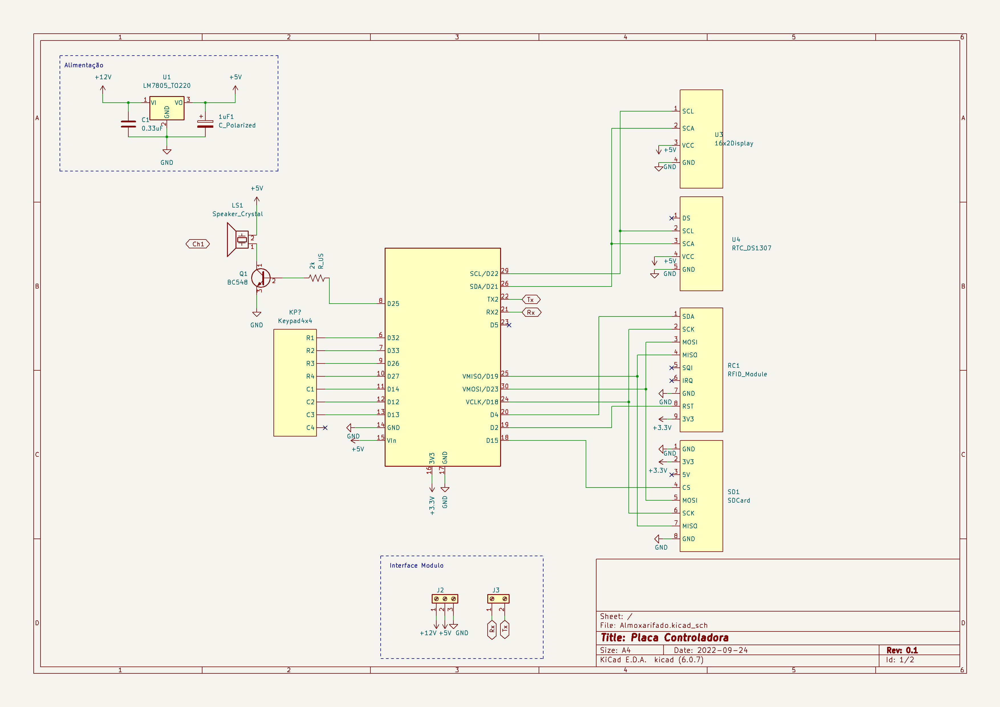

Esta semana, como definido no planejamento, começamos o teste dos módulos e componentes e a elaboração dos esquemáticos. Com uma versão preliminar
do esquemático pronta podemos testar os módulos já nas entradas do microcontrolador que queremos usar, assim evitando possíveis surpresas na hora
da montagem do protótipo das placas.

 <figcaption class="figure-caption">Esquematico do controlador</figcaption>

 <figcaption class="figure-caption">Esquematico do modulo</figcaption>