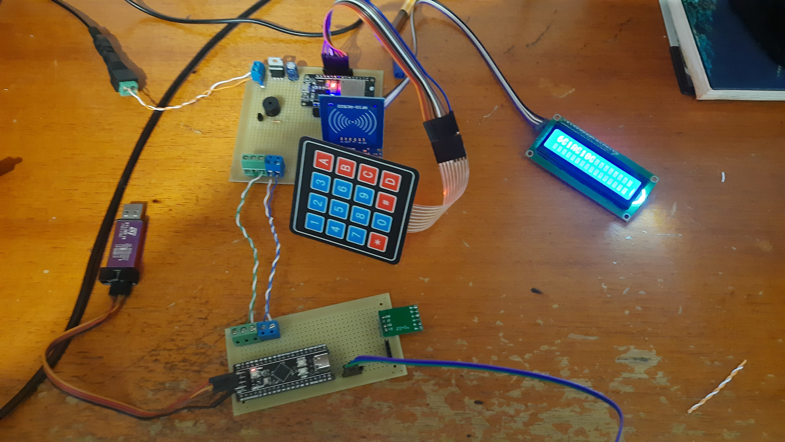

Esta semana utilizando os esquemáticos construímos os protótipos da placa controladora e da placa do módulo utilizando placas padrão.
Também foi realizado o teste simultâneo dos módulos testados individualmente com sucesso.

 <figcaption class="figure-caption text-center">Protótipo da placa controladora e do módulo</figcaption>
  

  Porem tivemos alguns problemas em relação ao esquemático. Primeiro ainda falta o módulo RTC, que ainda não conseguimos devido à falta
  de estoque na loja onde compramos os outros componentes. E o outro problema foi na montagem do relé na placa do módulo. Devido à falta de 
  espaço e a distância incomum entre os pinos do relé não foi possível montá-lo na placa. Para remediar esse problema utilizamos por enquanto um
  módulo pronto de relé, que embora não seja ideal atende as nossas necessidades.
