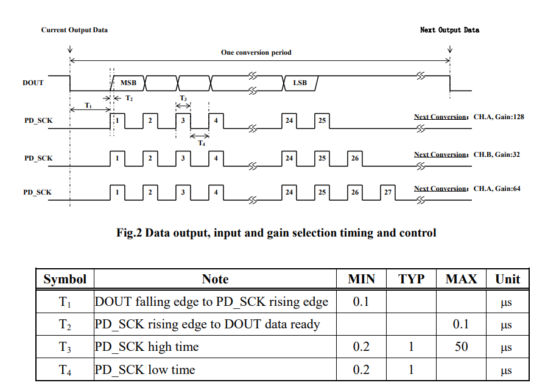

Após verificar o funcionamento da célula de carga usando o ESP32, o próximo passo foi verificar o comportamento desse sensor usando o STM32. 
Para isso utilizou-se a IDE STM32CubeIDE e foi preciso utilizar o manual do usuário e o *datasheet* do STM32. Além dos pinos de alimentação,
foram configurados dois pinos que, por meio do módulo conversor HX711, faziam a comunicação com a célula de carga. Um pino foi configurado
como entrada, para receber os dados digitais vindos do HX711, e o outro como saída, para estabelecer um sincronismo entre o módulo conversor
e o STM32.

### Driver da célula de carga

&nbsp;&nbsp;&nbsp;&nbsp;&nbsp;&nbsp; Pretende-se explicar resumidamente o funcionamento do driver da célula de carga. Foi necessário estudar
o *datasheet* do módulo HX711 para a elaboração do *firmware*. A saída digital do HX711 é um dado de 25 a 27 bits, sendo 24 bits responsáveis
por transmitir a massa do componente sendo medido e os restantes responsáveis por selecionar o ganho no módulo conversor.

&nbsp;&nbsp;&nbsp;&nbsp;&nbsp;&nbsp; Com 25 bits, o ganho 
é 128, ou seja, os dados analógicos provenientes da célula são amplificados por um fator igual a 128. Usando 25 bits, no caso desse projeto, 
falta analisar os 24 bits restantes que estão no formato de complemento de 2. Após corretamente decodificar os dados em complemento de 2 e analisar
o módulo, deve-se multiplicar esse valor por uma constante de calibração que efetue a conversão para uma unidade de medida. A unidade escolhida 
foi gramas.

  <figcaption class="figure-caption text-center">Dados no <i>datasheet</i> do módulo HX711</figcaption>

&nbsp;&nbsp;&nbsp;&nbsp;&nbsp;&nbsp; A figura do *datasheet* mostra a saída dos dados em direção ao microcontrolador, na linha de tempo DOUT. É preciso
respeitar também o tempo para o processamento dos dados. Da tabela na figura, a duração do pulso enviado do microcontrolador para o módulo deve
ser de no mínimo 0.2 microsegundos e de no máximo 50 microsegundos. Sem respeitar esse requisito, a saída digital do módulo é incorreta. Além de configurar
a duração desse pulso para 1 microsegundo, a equipe configurou os outros períodos para respeitar as especificações do *datasheet*.

### Integração com o projeto

&nbsp;&nbsp;&nbsp;&nbsp;&nbsp;&nbsp; Com o *firmware* da célula de carga funcional, o próximo passo é integrá-lo a lógica de aplicação do projeto.
A ideia é definir uma massa específica, de um determinado componente, e a partir da massa lida descobrir qual é o estoque desse componente, ou seja,
quantos estão depositados sobre a célula de carga.

                                                                                                                
                                                                                                              
