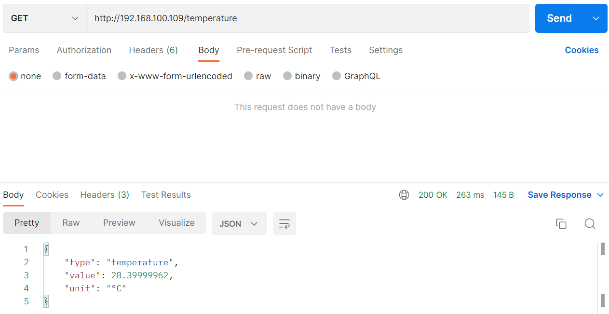
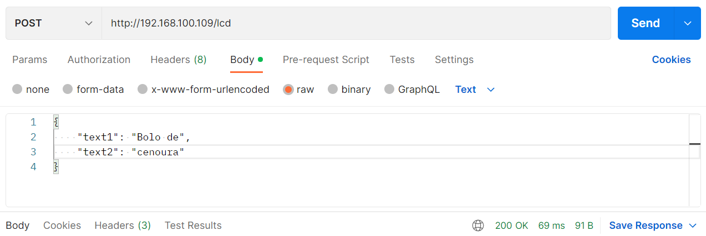
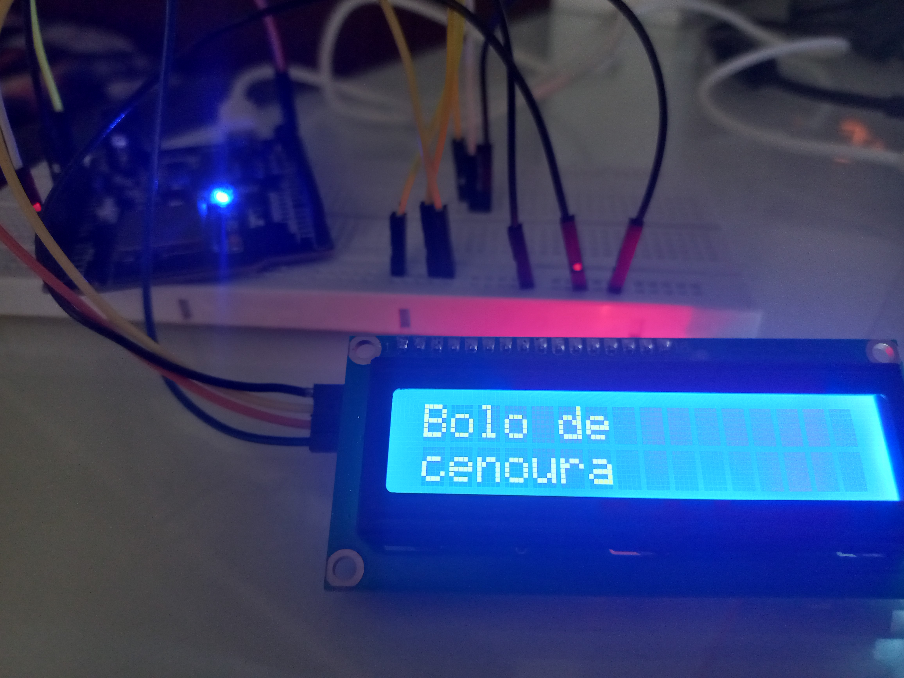

O primeiro passo para o desenvolvimento da interface web com o ESP32 foi o uso da API JSON. Essa API estabelece um
formato para a representação dos dados, estruturados em conformidade com a sintaxe do objeto JavaScript. Através do método GET, dados são
enviados do microcontrolador para um outro dispositivo conectado à rede wi-fi. Com o método POST, dados são enviados de um dispositivo
conectado à rede wi-fi para o microcontrolador. 

### Criação da API JSON

&nbsp;&nbsp;&nbsp;&nbsp;&nbsp;&nbsp; Para começar o desenvolvimento web, escolheu-se o sensor de temperatura LM35 para testar o método GET. Apesar
de não ser utilizado nesse projeto, foi escolhido esse sensor devido à facilidade do seu uso, uma vez que o propósito principal é testar a API 
JSON. Para testar o método POST, foi utilizado o display LCD 16x2 com comunicação serial I2C, que será importante para a interface com o usuário. 
Para testar o funcionamento da API JSON, foi utilizado o aplicativo Postman. Com o Postman, é possível visualizar as mensagens vindas do ESP32
bem como enviar dados através do método POST. Após efetuar a programação do ESP32 no PlatformIO para usar a API JSON, testou-se o método GET, conforme 
mostra a Figura 1. 

  <figcaption class="figure-caption text-center">Figura 1. Método GET para leitura de temperatura</figcaption>

&nbsp;&nbsp;&nbsp;&nbsp;&nbsp;&nbsp; Também foi testado o método POST, escrevendo dados no Postman e enviando-os para o ESP32. Após enviar duas strings com
um formato aceito pela API JSON, o display LCD passou a exibir essas duas strings. É bom destacar que a comunicação foi feita utilizando-se o wi-fi, depois
de configurar sua senha e SSID. A Figura 2 mostra como esses dados foram enviados usando o Postman, e a Figura 3 mostra o LCD após os dados serem enviados.

  <figcaption class="figure-caption text-center">Figura 2. Método POST para controlar o LCD</figcaption>

  <figcaption class="figure-caption text-center">Figura 3. LCD após efetuar a mensagem</figcaption>

### Próximos passos

&nbsp;&nbsp;&nbsp;&nbsp;&nbsp;&nbsp; Estabelecendo uma comunicação via wi-fi com o ESP32, o próximo passo é integrar os sensores e atuadores que efetivamente 
serão utilizados no projeto. Por meio da comunicação wi-fi e do servidor do ESP32, a idéia é desenvolver a interface com o usuário para que ele possa visualizar
os dados dos almoxarifados e eventualmente realizar modificações, caso possua permissão.

