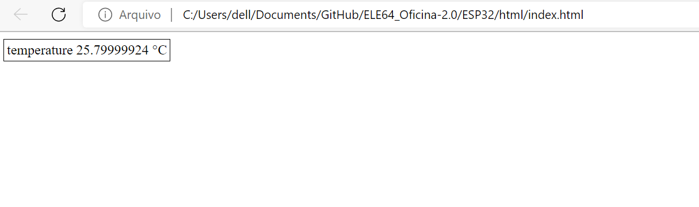

Após realizar os testes com a API JSON, que possibilita realizar a comunicação com o servidor do ESP32 através dos métodos POST e GET, focou-se
em implementar o site para o uso do usuário. Para isso, é necessário usar as linguagens de programação HTML e JavaScript para que os dados enviados
e recebidos sejam vistos pelo usuário através de um site. 

&nbsp;&nbsp;&nbsp;&nbsp;&nbsp;&nbsp; Novamente foi feito um teste para realizar a leitura de um sensor de temperatura remotamente, só que desta vez não
utilizou-se o aplicativo Postman, e sim um site. Utilizando uma simples tabela, foi possível ler a temperatura no site, conforme mostra a Figura 1.

  <figcaption class="figure-caption text-center">Figura 1. Lendo a temperatura através do servidor do ESP32</figcaption>

&nbsp;&nbsp;&nbsp;&nbsp;&nbsp;&nbsp; O próximo passo é usar a API JSON juntamente com o HTML/JavaScript para a construção do site que se comunica com 
o servidor do ESP32. Foi definido que o site deve apresentar telas ao usuário, onde pode-se obter informações bem como comunicar-se com o almoxarifado. 
As telas são divididas em dois grupos: de gerenciamento e de usuário.

#### Telas de usuário comum

**Tela de login**: Tela que requer login e senha do usuário e envia via um método POST para o servidor. Retorna um token único de autenticação.

**Tela geral**: Utilizando um método GET, lista todas as gavetas e suas propriedades: ID da gaveta, nome do objeto na gaveta, quantidade de objetos,
limite máximo de objetos na gaveta. Também deve listar se o usuário logado em específico tem algum empréstimo pendente.

### Telas de gerenciamento: para o administrador

**Tela de gerenciamento da gaveta**: mostra o histórico da gaveta e lista em uma tabela todos os objetos que se
encontram emprestados. Também deve ser possível editar o nome do objeto e se ele se trata de um objeto de “uso” ou de empréstimo através de um método POST.
Também deve existir um botão que leve a tela de cadastro de objeto.

**Tela de cadastro de objeto**: Deve exibir um pequeno guia passo a passo de como o usuário pode cadastrar um novo objeto. Os passos seriam:

1. Esvazie o compartimento
2. Insira n objetos e digite a quantidade inserida
3. Pressione o botão gravar novo objeto

Ao clicar no botão, um método POST deve ser enviado indicando qual gaveta deve ser “recalibrada” e qual quantidade foi inserida.

**Tela de gerenciamento de usuários**: Recupera do banco de dados todos os usuários registrados com um método GET, e lista em uma tabela: Nome do usuário,
Registro do usuario(RA), última vez que ele acessou o almoxarifado e se existe algum empréstimo pendente. Na mesma tabela há um botão levando para a tela de
edição de usuários. Em cima da tabela deve existir um botão para adicionar usuários.

**Tela de edição de usuários**: Nessa tela deve ser possível editar todas as informações de um usuário específico. Ao clicar no botão salvar, essas novas
informações devem ser enviadas através de um método POST. Também deve haver um botão para deletar um usuário em específico, utilizando o método POST.

**Tela de adição de usuários**: Idêntica à tela de edição de usuários, porém todos campos começam em branco e as informações devem ser enviadas com um
método POST distinto.

