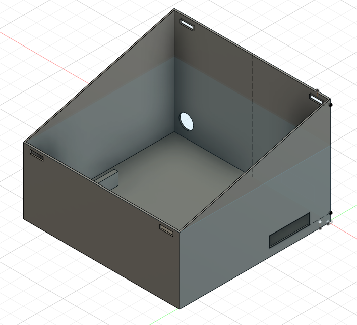
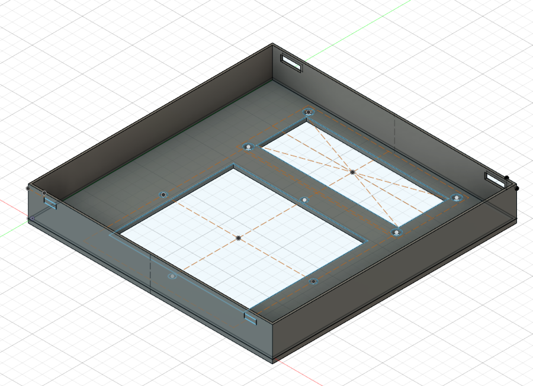
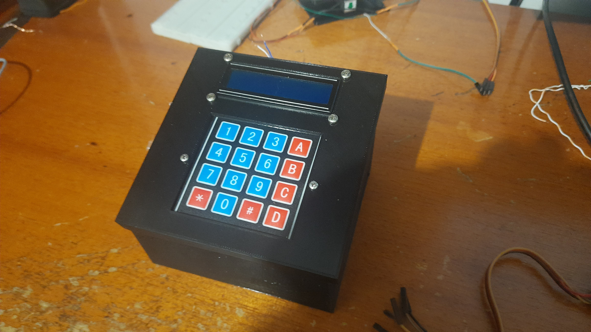

Com a placa do protototipo ja finalizada, utilizando o programa de CAD Fusion 360 e uma impressora 3D foi feita uma caixa personalizada para nosso controlador,
como mostrado nas figuras abaixo.

 <figcaption class="figure-caption text-center">Modelo CAD da base do controlador</figcaption>
  

  
  
  

 <figcaption class="figure-caption text-center">Modelo CAD da parte superior do controlador</figcaption>
  

  
  
    

 <figcaption class="figure-caption text-center">Controlador finalizado</figcaption>
  

