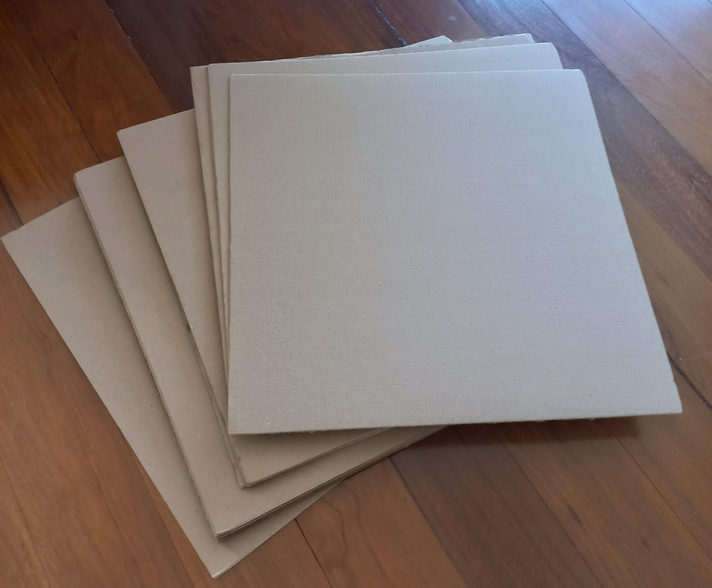

A equipe continuou o desenvolvimento do site e começou a planejar a construção da estrutura física do almoxarifado. Foram definidas as _features_ que o site
deveria possuir, como a exclusão e adição dos usuários (caso um administrador esteja usando) e a visualização dos dados do almoxarifado. Estudou-se a estrutura
que o site deveria ter para apresentar as diferentes informações para o usuário, que está ilustrada no tópico desenvolvimento do site. 

### Desenvolvimento do site

&nbsp;&nbsp;&nbsp;&nbsp;&nbsp;&nbsp; Criou-se um diagrama explicando o funcionamento do site, auxiliando a equipe no momento da programação em JavaScript/HTML. 
Primeiramente é solicitado ao usuário para que digite seu login, oferecendo a opção de criar um caso ele não o tenha. Após a validação das credenciais, ele é 
direcionado para a área do administrador ou do usuário comum, dependendo de seu ID e senha. Se for um usuário comum, poderá apenas ler as propriedades do 
almoxarifado, além de visualizar se possui algum empréstimo pendente. Caso seja um administrador, poderá tanto ler quanto alterar as propriedades do almoxarifado.

  <figcaption class="figure-caption text-center">Figura 1. Diagrama explicando funcionamento do site</figcaption>

## Estrutura física

&nbsp;&nbsp;&nbsp;&nbsp;&nbsp;&nbsp; Para a parte física do almoxarifado, decidiu-se usar papelão rígido e varetas de madeira para a construção da estrutura. 
Escolheu-se esses materiais devido à facilidade para manuseá-los e criar as diferentes partes necessárias para o projeto. As varetas de madeira servem para dar uma 
maior resistência mecânica à construção. A Figura 2 mostra estes materiais.

  <figcaption class="figure-caption text-center">Figura 2. Material para a construção da estrutura</figcaption>

