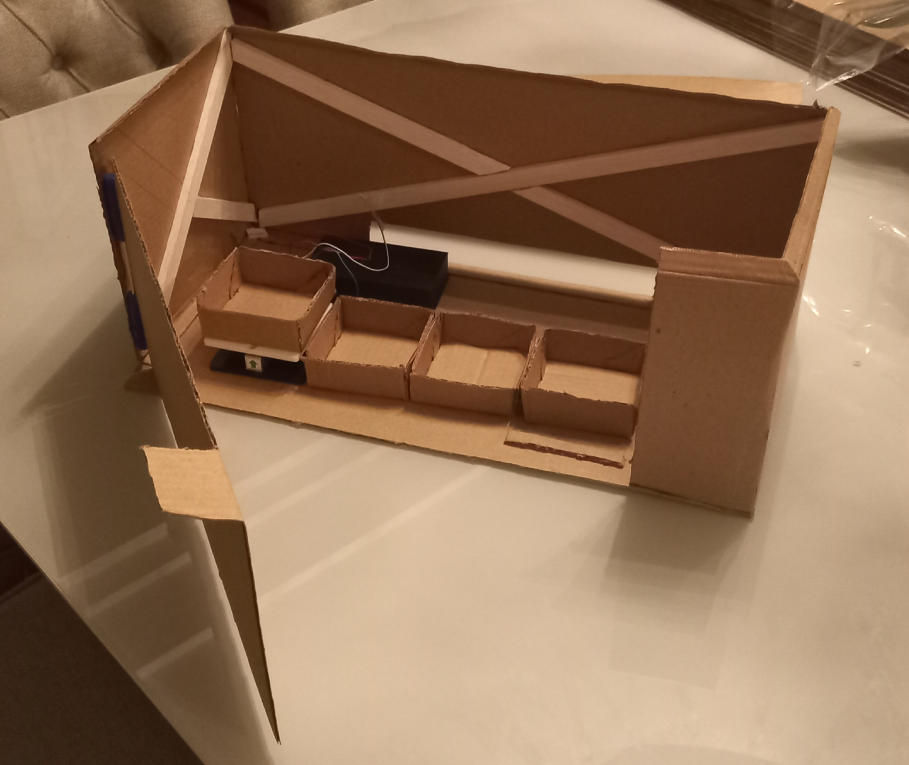

Na semana passada foram compradas as chapas de papelão rígido e as varetas de madeira para a construção da estrutura física. Nesta semana, 
foi construída boa parte da estrutura do almoxarifado. Também foram feitas as caixas dos módulos, onde os componentes serão depositados.
A Figura 1 mostra o estado da maquete até esta semana.

  <figcaption class="figure-caption text-center">Figura 1. Protótipo da estrutura física</figcaption>

## Vídeo de demonstração

<iframe class="center" width="560" height="315" src=["https://www.youtube.com/embed/zysUuyP_YAs"](https://youtu.be/94N0FYJIf88) title="YouTube video player"
frameborder="0" allow="accelerometer; autoplay; clipboard-write; encrypted-media; gyroscope; picture-in-picture" 
allowfullscreen></iframe>

## Próximos passos

&nbsp;&nbsp;&nbsp;&nbsp;&nbsp;&nbsp; É necessário inserir os componentes eletrônicos na maquete, em especial as células de carga, o solenóide e o fim
de curso que indicará quando o almoxarifado está fechado. Além disso, também pretende-se realizar os retoques finais na maquete, como fechá-la por cima
e alterar a porta de acesso para não deixar o solenóide visível quando ela está fechada.
