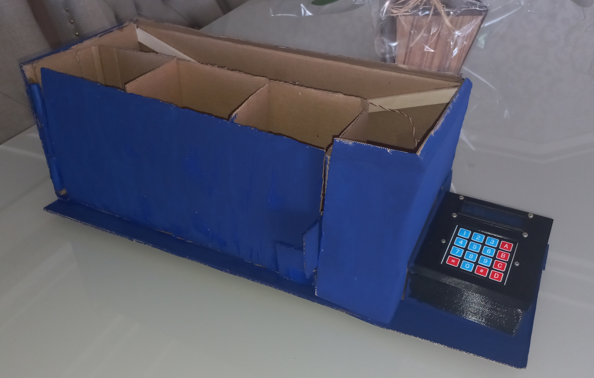
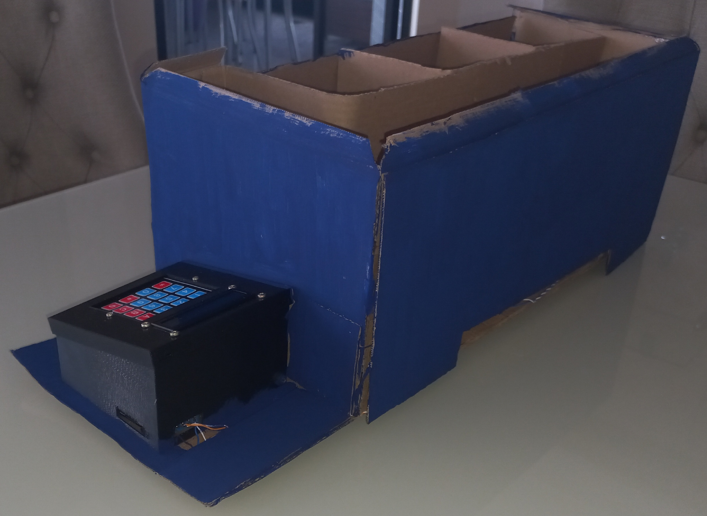

Na última semana iniciou-se a construção da estrutura física do almoxarifado, e nesta semana finalizou-se essa etapa. A principal tarefa foi a integração
dos componentes eletrônicos à maquete. Também foram realizadas algumas modificações, como o aumento das caixas dos módulos e a consequente diminuição da 
quantidade de módulos do sistema para 3. A caixa do controlador foi acoplada à lateral direita do almoxarifado, por onde o usuário pode interagir com o 
sistema através do teclado matricial e da tela LCD. A Figura 1 mostra a integração dos componentes eletrônicos com a maquete.

  <figcaption class="figure-caption text-center">Figura 1. Integração hardware/mecânica</figcaption>

&nbsp;&nbsp;&nbsp;&nbsp;&nbsp;&nbsp; Optou-se pela cor azul marinho para a decoração da maquete. A fiação do sistema ficou localizada na parte de trás do 
almoxarifado, escondida por uma parede adicional. Faltou apenas adicionar o teto. Decidiu-se colocá-lo após os testes de integração, para que seja possível
corrigir erros que podem aparecer. As Figuras 2 e 3 mostram outras vistas da estrutura.

  <figcaption class="figure-caption text-center">Figura 2. Estrutura vista de frente</figcaption>

  <figcaption class="figure-caption text-center">Figura 3. Estrutura vista de trás</figcaption>

## Conclusões

&nbsp;&nbsp;&nbsp;&nbsp;&nbsp;&nbsp; Testou-se o projeto ligando o controlador a uma fonte de 12V e funcionou de acordo com o esperado. Os objetos
que serão armazenados no almoxarifado ainda não foram definidos, pois deve-se atentar ao fato de que devem possuir o mesmo peso e devem estar dentro de um 
intervalo de peso aceitável para o projeto, de algumas gramas a centenas de gramas. 
